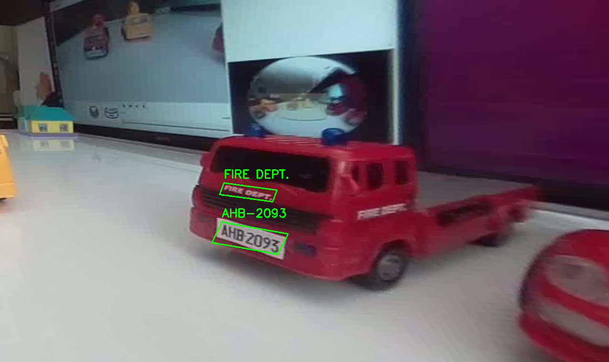
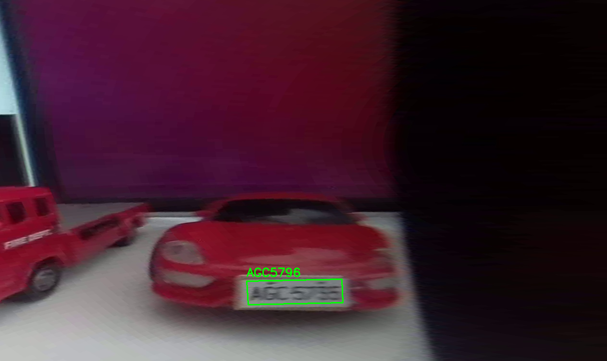

# Qt Mainmoil CUDA used on ALPR

## 1. Purpose

This repo is a guide describing how to acquire fisheye images from 220 degree raspberry pi camera, process with qt_mainmoil_cuda program, then use AWS Rekognition to do the license plate recognition.

Base on MOIL fisheye imaging, we hope to extend the MOIL application on ALPR( Automatic number-plate recognition )


基於 MOIL 魚眼技術應用於 車牌辨識，以達到大角度同時多個車牌辨識

## 2. Testing environment

- Raspberry Pi with a 220 degree fisheye camera  
- A PC with NVidea GPU Card running Ubuntu 18.04.
- All the above are wireless or wired connected    


## 3. Software Running

### 3.1 Raspberry Pi Camera

The first step is to prepare a Raspberry Pi camera with a 220 degree camera,

reference the repo,

https://github.com/yourskc/rpi_camera

check the IP address for later use.

```sh
ifconfig
```
enable the camera,

```sh
raspi-config
```

 then run the python script to start the streaming server

```sh
git clone https://github.com/yourskc/rpi_camera.git
cd rpi_camera
python rpi-camera.py
```


then you can enter the address in browser of another PC

> http://192.168.xx.xx:8000

dataset :

1. image : <a href="fisheye/220/moil_alpr_220.jpg">220</a> <a href="fisheye/160/moil_alpr_160.jpg">160</a>

2. video clip : <a href="fisheye/220/moil_alpr_220.mp4">220</a> <a href="fisheye/160/moil_alpr_160.mp4">160</a>

### 3.2 Qt_Mainmoil_Cuda

Please clone and run MOIL application qt_mainmoil_cuda.

https://github.com/yourskc/gt_mainmoil_cuda.git

( please email me if you need the previledge )

We need to set the camera source from IP camera instead of the default USB camera,

set the FORCE_CAMERA_USB to false in the mainwindow.cpp


Run the Qt Application, then enter the above IP address of the Raspberry Pi camera. for my case,

http://192.168.0.68:8000/stream.mjpg


Let's start record a video clip, press "Record" button to start/stop a recording

The recorded video should be a fisheye video, like this one

<a href="fisheye/220/moil_alpr_220.mp4">
</a>

The above video clip can be loaded into MOIL application again,


.

You can browse to any direction while playback the video clip.

We'll take some snapshots in the interested angles, and perform the

recognition in the next step.


### 3.3 AWS Rekognition for Text Recongnition

Since the ALPR is different from normal Text recongnition, usually the

Fonts on license plate are specially designed for license plate.

They are quite different from one contury to another. So, for the best

detection result, we need to train the model with real images. Here, we   

adopt a ready-to-use solution - AWS Rekognition API.

由於車牌字型與文件一般使用字型有所不同，自行訓練真實車牌 Model 需要大量影像樣本與時間，本實驗為快速驗證，後半部處理採用 AWS Rekognition 技術，相較於一般模型可以得到較佳之辨識結果。

Reference to PyImageSearch,

https://pyimagesearch.com/2022/03/21/text-detection-and-ocr-with-amazon-rekognition-api/

and AWS Rekognition official document,

https://docs.aws.amazon.com/rekognition/latest/dg/text-detecting-text-procedure.html

See the python program in the directory AWS_rekog

The most important steps are,

1. Modify the file aws_config_template.py with your access key, secret key, and AWS region. ( Before that, you need to register an AWS account). Save it as aws_config.py for later use.

2. Run the Python script

```sh
cd AWS_rekog
python amazon_ocr.py -i {imagefile}
```

The {imagefile} is the image filename saved in the previous step.

## 4. Results

Here are some of the results of AWS rekognition after MOIL process.  

### a.

<a href="rekog/output/output01.png">

</a>

Correct.

### b.

<a href="rekog/output/output02.png">

</a>

Correct.

### c.

<a href="rekog/output/output03.png">

</a>

Not correct

The reason is, the area near 180-220 degree have a poor resoluton and hard to do the recognition.

so we move the car to a smaller angle (about 160 degree ) and try again.

### c-2.

<a href="rekog/output/output03-c.png">

</a>

This time, we got a correct result.

### d.

<a href="rekog/output/output04.png">

</a>

Correct.

### e.

<a href="rekog/output/output05.png">

</a>

Not correct. ( Should be AKS-0267)

The reason is also because the resolution near 180-220 degree is not good enough.


## 5. Summary

The MOIL fisheye imaging can help the ALPR application to achieve wide angle image acquisition and multiple license plates recognition at the same time.

The experiment results show that most of the images undistorted using MOIL can have good recognition results, excepts those images corresponds to angles extreme left and right. Since the pixels on the fisheye image are not equally distributed, especially the region around and over 180 degree. To avoid the false recognition rate we may exclude the images from those area.

.


5.a Alpha angle and image height relationship

.

5.b The differential of the image height (Dh) from 0 to 110 degree, equivalent to alpha direction dencity.


5.c The image density is proportional to the ( 1 degree alpha x 1 degree beta ) area.

.


5.d The image density is proportional to the ( 1 degree alpha x 1 degree beta ) area.


.
The image density drops when alpha angle close to 90 degree ( see fig. 5.d ). However, the most important influences is the alpha directional  density drop( see fig. 5.b ). In this experiment we need to abandon part of the angles close to 90. From the recognition result we decide to set the bounday at 80 degree.  

This research is still continue.
